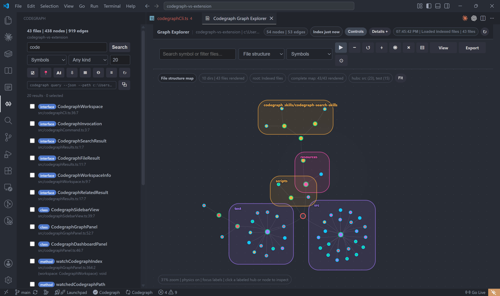
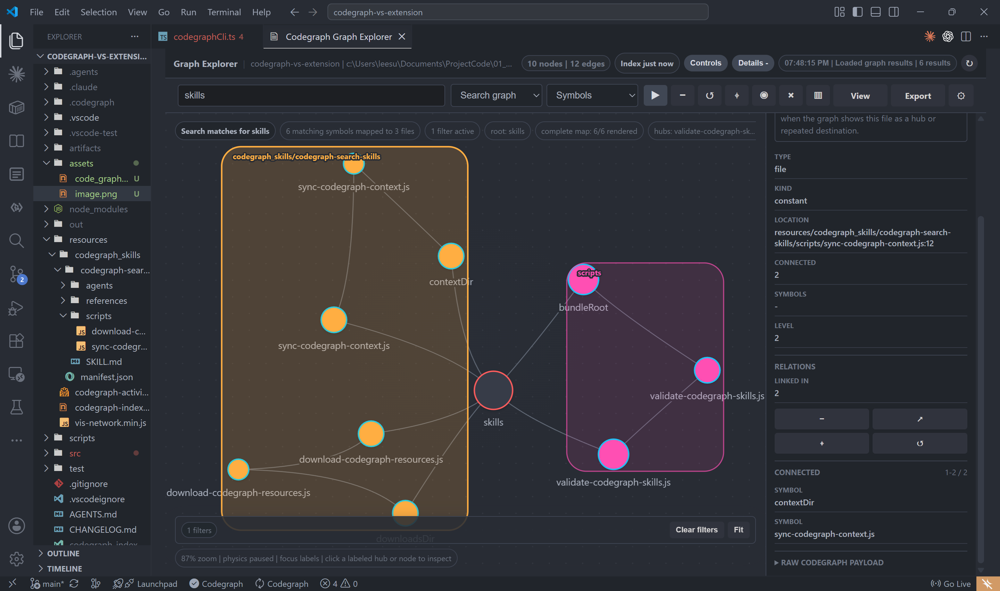
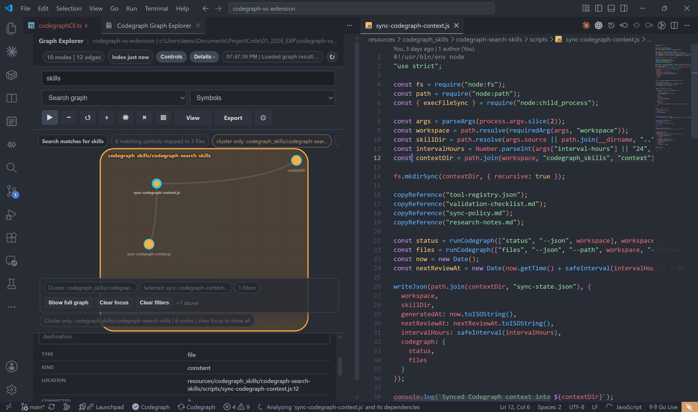

# Codegraph Explorer

이미 `.codegraph` 인덱스를 쓰고 있는 프로젝트를 VS Code 안에서 더 빠르게 탐색하기 위한 가벼운 확장입니다. VS Code를 떠나지 않고 심볼, 인덱싱된 파일 텍스트, 파일 경로, callers, callees, impact를 대시보드, 사이드바, 그래프 뷰에서 검색할 수 있습니다.

[Visual Studio Marketplace에서 설치하기](https://marketplace.visualstudio.com/items?itemName=datanewbie-labs.codegraph-index-explorer)

VS Code 확장 검색에서 **Codegraph Explorer**를 검색해 설치해 주세요.

[English README](README.md)



## 어떤 확장인가요?

Codegraph Explorer는 Codegraph 자체를 새로 만드는 도구가 아닙니다. 이미 만들어진 `.codegraph` 인덱스를 VS Code 안에서 읽고, 개발자가 바로 이동하고 확인할 수 있게 보여주는 탐색 도구입니다.

- 심볼, 파일 이름, 파일 안의 텍스트 매치를 VS Code에서 바로 검색합니다.
- 검색 결과를 파일, 줄, 컬럼 위치로 바로 엽니다.
- callers, callees, impact 같은 관계 정보를 확인합니다.
- Graph Explorer에서 노드와 파일 관계를 확대, 축소, 드래그, 포커스 모드로 살펴봅니다.
- 선택한 결과의 정확한 위치나 에이전트에게 넘기기 좋은 프롬프트를 복사합니다.
- 기존 Codegraph CLI, MCP, 에이전트 워크플로와 함께 쓰도록 작고 가볍게 유지합니다.

## 0.0.62에서 달라진 점

- 대시보드, 사이드 뷰, Graph Explorer에서 **Symbols**, **Text in files**,
  **File names**, **Callers**, **Callees**, **Impact** 검색 모드를 사용할 수
  있습니다.
- 대시보드와 사이드 뷰의 빈 상태가 더 명확해졌고, 샘플 검색, 인덱싱된 파일
  보기, 파일 그래프 열기로 바로 이동할 수 있습니다.
- Graph Explorer 컨트롤이 일관된 아이콘 버튼으로 정리되었고, 선택한 노드의
  위치를 빠르게 복사하는 **Copy location** 액션이 추가되었습니다.
- 업데이트 내역 명령은 Command Palette와 사이드 뷰에서 제거해 검색, 그래프,
  새로고침, 번들 스킬 설치 흐름에 집중하도록 했습니다.

## 설치 방법

가장 쉬운 방법은 VS Code에서 직접 설치하는 것입니다.

1. VS Code 왼쪽의 Extensions를 엽니다.
2. **Codegraph Explorer**를 검색합니다.
3. 게시자가 **DataNewbie Labs**인지 확인합니다.
4. **Install**을 누릅니다.

명령으로 설치할 수도 있습니다.

```text
ext install datanewbie-labs.codegraph-index-explorer
```

마켓플레이스 주소:

[datanewbie-labs.codegraph-index-explorer](https://marketplace.visualstudio.com/items?itemName=datanewbie-labs.codegraph-index-explorer)

Codegraph를 쓰는 개발자에게 도움이 된다면, 마켓플레이스에서 **Codegraph Explorer**를 검색해 설치하고 주변에도 추천해 주세요.

## 초기 설정

이 확장은 열린 워크스페이스 안에 `.codegraph` 디렉터리가 있을 때 활성화됩니다. 먼저 프로젝트에 Codegraph 인덱스가 준비되어 있어야 합니다.

필요한 것:

- VS Code `1.92.0` 이상
- 신뢰된 VS Code 워크스페이스
- Codegraph CLI가 아직 없다면 Node.js와 `npm`
- `PATH`에서 실행 가능한 `codegraph` CLI
- `.codegraph` 디렉터리가 있는 프로젝트

`codegraph --version`이 실행되지 않으면 먼저 Codegraph CLI를 설치합니다.

`npm` 명령도 없다면 Node.js와 npm부터 설치해야 합니다. 최소 Linux
컨테이너 이미지에는 둘 다 빠져 있는 경우가 많습니다.

Debian/Ubuntu:

```sh
apt-get update
apt-get install -y nodejs npm
```

Alpine:

```sh
apk add --no-cache nodejs npm
```

Fedora/RHEL:

```sh
dnf install -y nodejs npm
```

Windows PowerShell:

```powershell
node --version
npm --version
npm install -g @colbymchenry/codegraph
codegraph --version
```

PowerShell 실행 정책 때문에 npm 스크립트 shim이 막히면
`codegraph.cmd --version`으로 확인하고, `where.exe codegraph`가 보여주는
전체 `codegraph.cmd` 경로를 `codegraph.cliPath`에 지정해 주세요.

macOS/Linux:

```sh
node --version
npm --version
npm install -g @colbymchenry/codegraph
codegraph --version
```

Debian/Ubuntu 기반 Dockerfile에서는 다음처럼 넣을 수 있습니다.

```dockerfile
RUN apt-get update \
  && apt-get install -y --no-install-recommends nodejs npm \
  && npm install -g @colbymchenry/codegraph \
  && rm -rf /var/lib/apt/lists/*
```

전역 npm 설치에 권한 문제가 나면 `sudo`보다 사용자 npm prefix를 권장합니다.

```sh
mkdir -p ~/.npm-global
npm config set prefix ~/.npm-global
export PATH="$HOME/.npm-global/bin:$PATH"
npm install -g @colbymchenry/codegraph
codegraph --version
```

기본 흐름:

```sh
codegraph --version
codegraph init
```

그 다음 프로젝트를 VS Code로 열면 왼쪽 Activity Bar에 `Codegraph`가 나타납니다. 이미 VS Code를 열어 둔 상태에서 `.codegraph`를 만들었다면 Command Palette에서 `Codegraph: Refresh`를 실행해 주세요.

`codegraph` 명령이 PATH에 없다면 VS Code 설정에서 CLI 경로를 지정할 수 있습니다.

```json
{
  "codegraph.cliPath": "/absolute/path/to/codegraph"
}
```

Windows에서 예를 들면 다음처럼 설정할 수 있습니다.

```json
{
  "codegraph.cliPath": "C:\\\\tools\\\\codegraph\\\\codegraph.exe"
}
```

선택적으로 에이전트 MCP 설정도 설치할 수 있습니다.

```sh
codegraph install
```

에이전트에서 비대화형으로 설정해야 하면 다음 명령을 사용하세요.

```sh
codegraph install --target auto --location global --yes
```

VS Code 확장은 MCP 없이도 로컬 `.codegraph` 인덱스를 읽을 수 있습니다. MCP
설정은 지원되는 코딩 에이전트가 Codegraph 도구를 직접 호출해야 할 때 필요합니다.

### MCP PATH 문제 해결

MCP 로그에 다음처럼 나온다면:

```text
Connection failed: Executable not found in $PATH: "codegraph"
```

Codegraph가 설치되어 있어도 MCP 프로세스가 실행 파일을 못 찾는 상태일 수
있습니다. 예를 들어 실제 바이너리는 `/root/.local/bin/codegraph`에 있는데
MCP 설정은 `"command": "codegraph"`이고, 현재 `PATH`에는 `/root/.local/bin`이
없을 수 있습니다.

확인:

```sh
printf '%s\n' "$PATH"
ls -l /root/.local/bin/codegraph 2>/dev/null || true
command -v codegraph || true
```

환경을 바꾸기 전에는 사용자에게 먼저 확인하세요. 그 다음 아래 중 하나를
선택합니다.

```sh
# 방법 1: 이미 PATH에 있는 디렉터리로 심볼릭 링크 추가
ln -s /root/.local/bin/codegraph /usr/local/bin/codegraph

# 방법 2: 이후 셸에 ~/.local/bin 추가
echo 'export PATH="$HOME/.local/bin:$PATH"' >> ~/.bashrc
export PATH="$HOME/.local/bin:$PATH"
```

또는 MCP 설정의 command를 `/root/.local/bin/codegraph` 같은 절대 경로로 바꿀
수 있습니다. PATH나 MCP 설정을 바꾼 뒤에는 에이전트를 재시작하거나 새로고침해
주세요.

## 사용 방법

`.codegraph`가 있는 프로젝트를 열고 아래 진입점 중 하나를 사용하세요.

- Activity Bar: `Codegraph`
- Status Bar: `Codegraph`
- Command Palette: `Codegraph: Open Dashboard`
- Command Palette: `Codegraph: Open Graph Explorer`
- Command Palette: `Codegraph: Search Symbols`
- 단축키: Windows/Linux `Ctrl+Alt+G`, macOS `Cmd+Alt+G`

대시보드와 사이드 뷰에서는 인덱스 상태, 인덱싱된 파일, 검색 결과, 관련 액션을 볼 수 있습니다. 결과를 선택하면 해당 소스 파일의 위치로 바로 이동합니다.

검색 모드:

- **Symbols**는 Codegraph 심볼을 검색하며 kind 필터를 사용할 수 있습니다.
- **Text in files**는 현재 Codegraph 인덱스에 포함된 파일 안의 텍스트를
  검색합니다.
- **File names**는 인덱싱된 파일 이름과 경로를 검색합니다.
- **Callers**, **Callees**, **Impact**는 심볼의 관계 정보를 검색합니다.

Graph Explorer는 별도 패널에서 열리며 관계 그래프를 보여줍니다. 확대/축소, 노드 드래그, 포커스 모드, 미니맵, 호버 미리보기, 상세 액션을 지원합니다.





## 주요 명령

| 명령 | 설명 |
| --- | --- |
| `Codegraph: Open Dashboard` | 메인 Codegraph 대시보드를 엽니다. |
| `Codegraph: Open Graph Explorer` | 시각적인 그래프 패널을 엽니다. |
| `Codegraph: Search Symbols` | 인덱싱된 심볼을 검색합니다. |
| `Codegraph: Show Status` | 현재 Codegraph 워크스페이스 상태를 보여줍니다. |
| `Codegraph: List Indexed Files` | 인덱싱된 파일 목록을 봅니다. |
| `Codegraph: Refresh` | 확장 캐시를 지우고 상태와 사이드바 데이터를 새로고침합니다. |
| `Codegraph: Install Bundled Agent Skills (Choose Destinations)` | 포함된 Codegraph 스킬을 설치할 워크스페이스 위치를 하나 이상 선택합니다. 선택한 위치에만 파일을 씁니다. |
| `Codegraph: Copy Agent Setup Prompt` | 현재 워크스페이스에 Codegraph를 설치하고 초기화하도록 에이전트에 전달할 안전한 프롬프트를 복사합니다. |
| `Codegraph: Open Official Setup Guide` | 공식 [colbymchenry/codegraph](https://github.com/colbymchenry/codegraph) 저장소를 엽니다. |

## 설정

| 설정 | 기본값 | 설명 |
| --- | --- | --- |
| `codegraph.searchLimit` | `20` | 보여줄 검색 결과의 최대 개수입니다. |
| `codegraph.cliPath` | `codegraph` | Codegraph CLI를 실행할 명령 또는 경로입니다. |
| `codegraph.preloadOnActivation` | `true` | 활성화 직후 상태와 인덱싱된 파일을 미리 읽어 대시보드와 사이드바 반응을 빠르게 합니다. |

## 인덱스 새로고침

확장은 로컬 Codegraph CLI가 알려주는 내용을 읽습니다. Codegraph 설정이 코드 변경을 자동으로 다시 인덱싱하고 `.codegraph`에 업데이트한다면, 확장도 그 변경을 읽을 수 있습니다.

- Graph Explorer가 열려 있는 동안 `.codegraph/**` 변경을 감지합니다.
- 인덱스 파일이 바뀌면 확장 내부 캐시를 지우고 메타데이터를 다시 읽습니다.
- Graph Explorer에는 `Index just now`, `Index 5m ago` 같은 최신 상태 표시가 나옵니다.
- 대시보드, 사이드 뷰, 명령 팔레트 검색, 상태바는 짧은 CLI 캐시를 사용합니다.
- 강제로 새로 읽고 싶을 때는 `Codegraph: Refresh`를 실행하세요.

이 확장은 Codegraph 자동 동기화를 직접 시작하거나 관리하지 않습니다. 자동 동기화는 사용 중인 Codegraph CLI, MCP, 데몬 설정이 담당합니다.

## 이 확장의 방향

CodeGraph 계열 도구 중에는 파서, 인덱서, 언어 서버, MCP 서버, 메모리 레이어, AI 요약 기능까지 포함하는 확장이 많습니다. Codegraph Explorer는 의도적으로 더 좁은 역할에 집중합니다.

- `.codegraph`가 이미 있는 워크스페이스에서만 활성화됩니다.
- 로컬 `codegraph` CLI를 호출하고 JSON 결과를 보여줍니다.
- 빠른 탐색, 파일 발견, 관계 확인, 그래프 브라우징에 집중합니다.
- 코딩 에이전트에게 정확한 위치와 맥락을 넘기기 쉽게 돕습니다.
- 기존 Codegraph 환경을 대체하지 않고, 그 옆에서 쓰는 작은 탐색 도구로 남습니다.

## 개발

의존성을 설치하고 webview 의존성을 복사합니다.

```sh
npm install
npm run sync:vis-network
```

자주 쓰는 개발 명령:

```sh
npm run compile
npm test
npm run test:extension
npm run package
```

이 폴더를 VS Code에서 열고 `F5`를 누르면 Extension Development Host가 실행됩니다.

## 패키징

로컬 VSIX 생성:

```sh
npm run package
```

생성된 `.vsix`는 VS Code의 `Extensions: Install from VSIX`로 설치할 수 있습니다.

공개 배포 전에는 다음을 확인하세요.

- `package.json`의 `publisher`가 마켓플레이스 게시자 계정과 일치하는지 확인합니다.
- repository, homepage, issue tracker 메타데이터가 공개 GitHub 저장소를 가리키는지 확인합니다.
- `npm test`를 실행합니다.
- 생성된 `.vsix`, 로컬 `.codegraph`, 테스트 산출물, `node_modules`가 커밋되지 않도록 확인합니다.

## 저장소 구성

- `src/` - 확장 소스 코드
- `resources/` - 패키지에 포함되는 확장 자산과 Codegraph 스킬
- `scripts/` - 유지보수와 검증 스크립트
- `test/` - 단위 테스트, 패키지 테스트, 에셋 테스트, 그래프 테스트, 확장 스모크 테스트
- `CHANGELOG.md` - 릴리스 기록
- `README.md` - 영어 README

## 라이선스

MIT
